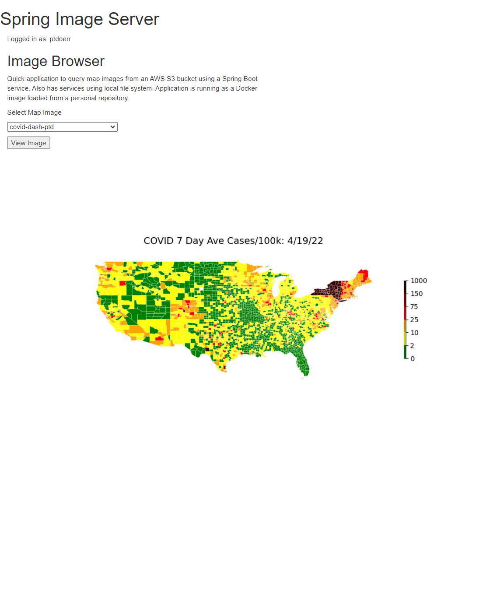

# spring-image-server

I built this application to provide access to some COVID county leval case maps that I built with my COVID Dashboard notebook. There are service endpoints to list 
and display images from an AWS S3 bucket or local file system. There is a basic index.html to access the services and display images. The page is authenticated through GitHub using Oauth.

Here's a [link to the running application.](http://66.228.55.215:8080) It's running on a Linode instance as a docker image.

## HTTP Services
- */user* - returns authenticated user login name
- */maps-list* - returns json list of files
- */map-image-file?fname= * - returns map image from file system
- */s3-maps-list* - returns json list of files from S3 bucket
- */map-image-file?fname= * - returns map image from S3 bucket

## Installation

The following are required
- jdk 17
- maven 3
- docker 23
- docker-compose 1.29

#### Build and run local server
./mvnw spring-boot:run  

#### Build Docker Image
./mvnw spring-boot:build-image

## Running
docker-compose up

### Required Environment Variables

- AWS_ACCESS_KEY_ID
- AWS_SECRET_ACCESS_KEY
- GITHUB_CLIENT_ID
- GITHUB_CLIENT_SECRET
- S3_IMAGE_BUCKET
- LOCAL_IMAGE_DIR - local directory containing images
